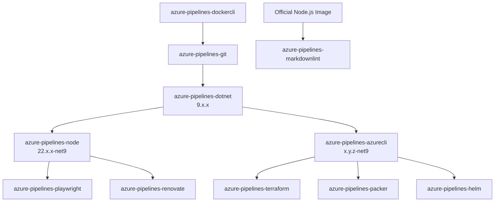

## Hi there 👋

This is the GitHub organization for Swiss GRC, a leading software company in the development and implementation of Governance, Risk & Compliance solutions "Swiss made" for companies worldwide.
You can find out more about our company and products at [swissgrc.com](https://swissgrc.com/en/).

Here you will find:

🐳 Docker images for using in [Azure Pipelines Container Jobs](https://docs.microsoft.com/en-us/azure/devops/pipelines/process/container-phases):

* [Docker CLI](https://github.com/swissgrc/docker-azure-pipelines-dockercli)
* [Git](https://github.com/swissgrc/docker-azure-pipelines-git)
* [.NET 9](https://github.com/swissgrc/docker-azure-pipelines-dotnet-9)
* [Node.js 22 with .NET 9](https://github.com/swissgrc/docker-azure-pipelines-node22-net9)
* [Azure CLI with .NET 9](https://github.com/swissgrc/docker-azure-pipelines-azurecli-net9)
* [Terraform](https://github.com/swissgrc/docker-azure-pipelines-terraform)
* [Packer](https://github.com/swissgrc/docker-azure-pipelines-packer)
* [Helm](https://github.com/swissgrc/docker-azure-pipelines-helm)
* [Playwright](https://github.com/swissgrc/docker-azure-pipelines-playwright)
* [Markdownlint](https://github.com/swissgrc/docker-azure-pipelines-markdownlint)
* [Renovate](https://github.com/swissgrc/docker-azure-pipelines-renovate)

Images are available from [GitHub Container Registry](https://github.com/orgs/swissgrc/packages?ecosystem=container)
or [Docker Hub](https://hub.docker.com/u/swissgrc).

🧩 NuGet packages:

* [Statiq.Alerts](https://github.com/swissgrc/Statiq.Alerts)

📦 NPM packages:

* [PostCSS plugin to remove font faces formats](https://github.com/swissgrc/postcss-remove-font-face-format)

🍫 Chocolatey packages:

* [Public Chocolatey packages maintained by Swiss GRC](https://github.com/swissgrc/chocolatey-packages)
