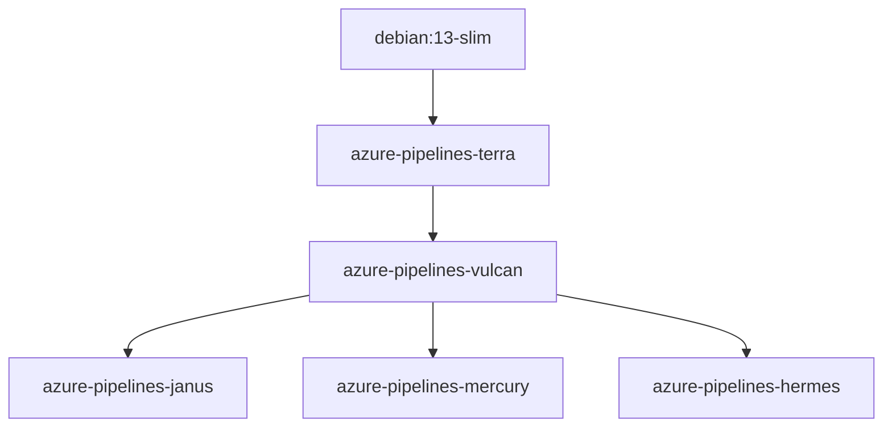

## Hi there 👋

This is the GitHub organization for Swiss GRC, a leading software company in the development and implementation of Governance, Risk & Compliance solutions "Swiss made" for companies worldwide.
You can find out more about our company and products at [swissgrc.com](https://swissgrc.com/en/).

Here you will find:

🐳 [Docker images](https://github.com/swissgrc/docker-azure-pipelines) for using in [Azure Pipelines Container Jobs](https://docs.microsoft.com/en-us/azure/devops/pipelines/process/container-phases):

* [`azure-pipelines-terra`](https://github.com/swissgrc/docker-azure-pipelines) — L1 foundation (Docker CLI, Git, jq, yq, …)
* [`azure-pipelines-vulcan`](https://github.com/swissgrc/docker-azure-pipelines) — L2 build runtimes (.NET, Node.js)
* [`azure-pipelines-janus`](https://github.com/swissgrc/docker-azure-pipelines) — L3 deployment (Azure CLI, Terraform, Packer, Helm, kubectl)
* [`azure-pipelines-mercury`](https://github.com/swissgrc/docker-azure-pipelines) — L3 end-to-end testing (Playwright)
* [`azure-pipelines-hermes`](https://github.com/swissgrc/docker-azure-pipelines) — L3 dependency updates (Renovate)

```mermaid
graph TB
    terra[azure-pipelines-terra]
    click terra "https://github.com/swissgrc/docker-azure-pipelines"

    vulcan[azure-pipelines-vulcan]
    click vulcan "https://github.com/swissgrc/docker-azure-pipelines"

    janus[azure-pipelines-janus]
    click janus "https://github.com/swissgrc/docker-azure-pipelines"

    mercury[azure-pipelines-mercury]
    click mercury "https://github.com/swissgrc/docker-azure-pipelines"

    hermes[azure-pipelines-hermes]
    click hermes "https://github.com/swissgrc/docker-azure-pipelines"

    %% External base image
    debian[debian:13-slim]
    click debian "https://hub.docker.com/_/debian"

    %% Inheritance relationships (top-down)
    debian --> terra
    terra --> vulcan
    vulcan --> janus
    vulcan --> mercury
    vulcan --> hermes
```

Images are available from the [GitHub Container Registry](https://github.com/orgs/swissgrc/packages?ecosystem=container) under `ghcr.io/swissgrc/`.

🧩 NuGet packages:

* [Statiq.Alerts](https://github.com/swissgrc/Statiq.Alerts)

📦 NPM packages:

* [PostCSS plugin to remove font faces formats](https://github.com/swissgrc/postcss-remove-font-face-format)

🍫 Chocolatey packages:

* [Public Chocolatey packages maintained by Swiss GRC](https://github.com/swissgrc/chocolatey-packages)
